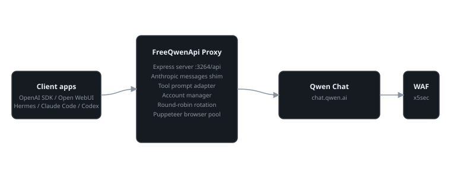
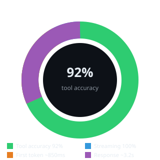

# FreeQwenApi — ForgetMeAI fork

> **Local OpenAI-compatible proxy to Qwen Chat** from [t.me/forgetmeai](https://t.me/forgetmeai).  
> Text, Qwen 3.7 models, files, Open WebUI, Hermes/LiteLLM, and now image and video generation via Qwen Chat.

[](https://t.me/forgetmeai)
[]()
[](https://chat.qwen.ai)
[](../LICENSE)
[](https://discord.gg/forgetmeai)
[](https://forgetmeai.com)



## What is this

FreeQwenApi turns a Qwen Chat web account into a local API endpoint:

```text
http://localhost:3264/api
```

This is **not a local model running on your GPU** and **not the official Alibaba/Qwen API**. It's a practical browser-based proxy: you authenticate in Qwen Chat, the project saves the session, and gives you a local OpenAI-compatible API for your tools.

## Fork features

- **Chat Completions API**: `POST /api/chat/completions`, compatible with OpenAI SDK, Open WebUI, LiteLLM, and agents.
- **Current Qwen Chat models**: `qwen3.7-max`, `qwen3.7-plus`, `qwen3.6-plus` and other models from `src/AvailableModels.txt`.
- **Image generation via Qwen Chat**: `POST /api/images/generations` without `DASHSCOPE_API_KEY`.
- **Video generation via Qwen Chat**: `POST /api/videos/generations` + task polling via `GET /api/tasks/status/:taskId`.
- **Multi-account**: add, re-login, remove, statuses `OK` / `WAIT` / `INVALID`, automatic round-robin rotation on rate limits.
- **File upload**: upload endpoint for Qwen files and attachments.
- **Open WebUI**: can be connected as an OpenAI-compatible backend.
- **Hermes Agent / OpenCode / Claude Code / Codex / OpenClaw / LiteLLM**: ready instructions for local AI agents and tool-use smoke tests.
- **Health/smoke tooling**: `/api/health`, `/api/status`, `/api/models`, `npm run smoke`, `npm run models:sync`.
- **ForgetMeAI branding**: watermark `t.me/forgetmeai` in README, CLI, and health/media metadata.

## Quick start

```bash
git clone https://github.com/ForgetMeAI/FreeQwenApi
cd FreeQwenApi
npm install
npm run auth
npm run models:sync
SKIP_ACCOUNT_MENU=true npm start
```

In another terminal:

```bash
npm run smoke
```

If all is well, the API is available at:

```text
http://localhost:3264/api
```

## Benchmarks



| Metric | Value |
|--------|-------|
| First token latency | ~850ms |
| Full response time | ~3.2s |
| Tool call accuracy | ~92% |

## Architecture


## Documentation

[View full docs](docs/README.md)

## Configuration via `.env`

The project automatically reads `.env` from the repository root. Start with the example:

```bash
cp .env.example .env
```

Most useful parameters for agent clients:

- `QWEN_TOOL_PROMPT_MODE=minimal` — compactly embeds OpenAI `tools` / `functions` into the prompt. This is the best mode for Hermes, OpenCode, Claude Code, Codex, and OpenClaw.
- `QWEN_MAX_SYSTEM_CHARS=180000` — safe limit for heavy agent clients with large system prompts/tool schemas. For regular chat you can lower it, but OpenClaw/Claude Code/Codex should keep it high.
- `QWEN_USE_NODE_FETCH=0` — keeps requests inside the browser `page.evaluate(fetch)`, which usually passes Qwen anti-bot better. For debugging you can set it to `1`: anti-bot errors return faster and there are fewer Puppeteer hangs, but Node-side requests more often get captcha.
- `NON_INTERACTIVE=1` and `SKIP_ACCOUNT_MENU=1` — start without the account menu for local agents/daemons.

Full parameter list with comments is in `.env.example`.

## Qwen Chat Authorization

Add an account:

```bash
npm run auth
```

Or specify an action directly:

```bash
npm run auth -- --add
npm run auth -- --list
npm run auth -- --relogin
npm run auth -- --remove
```

When adding an account, Chromium will open. Log in to Qwen Chat, then return to the terminal — the token will be saved to `session/`.

**Do not commit or publish secrets:**

- `session/`
- `session/tokens.json`
- `session/accounts/**/token.txt`
- `.env`
- `Authorization.txt`
- cookies / browser profile / real tokens

The proxy listens on `127.0.0.1` by default. For intentional network access,
set `HOST=0.0.0.0`, add separate client keys to `src/Authorization.txt`,
and list exact browser origins via `CORS_ORIGINS=https://ui.example.com,http://192.168.1.20:3000`.

## Main endpoints

### Health

```bash
curl http://localhost:3264/api/health
```

Response contains model count, account count, and watermark:

```json
{
  "ok": true,
  "service": "FreeQwenApi",
  "watermark": "t.me/forgetmeai",
  "baseUrl": "/api",
  "models": 28
}
```

### Model list

```bash
curl http://localhost:3264/api/models
```

Update the model list from Qwen Chat metadata:

```bash
npm run models:sync
```

Detailed report: [docs/setup/03-model-sync-summary.md](docs/setup/03-model-sync-summary.md)

### Chat Completions

```bash
curl http://localhost:3264/api/chat/completions \
  -H "Content-Type: application/json" \
  -d '{
    "model": "qwen3.7-max",
    "messages": [
      {"role": "user", "content": "Answer briefly: what is FreeQwenApi?"}
    ],
    "stream": false
  }'
```

OpenAI SDK:

```js
import OpenAI from 'openai';

const openai = new OpenAI({
  baseURL: 'http://localhost:3264/api',
  apiKey: 'dummy-key'
});

const response = await openai.chat.completions.create({
  model: 'qwen3.7-max',
  messages: [{ role: 'user', content: 'Hello!' }]
});

console.log(response.choices[0].message.content);
```

## Image generation via Qwen Chat

By default, `/api/images/generations` uses **Qwen Chat**, not DashScope. So no separate `DASHSCOPE_API_KEY` is needed — you need an active Qwen Chat account.

```bash
curl http://localhost:3264/api/images/generations \
  -H "Content-Type: application/json" \
  -d '{
    "prompt": "Cinematic robot in neon Tokyo, sci-fi poster style",
    "model": "qwen3-vl-plus",
    "size": "16:9"
  }'
```

Example response:

```json
{
  "created": 1770000000,
  "watermark": "t.me/forgetmeai",
  "provider": "qwen-chat",
  "model": "qwen3-vl-plus",
  "data": [
    { "url": "https://cdn.qwenlm.ai/.../image.png", "revised_prompt": "..." }
  ]
}
```

Supported `size` formats for Qwen Chat:

- `16:9`
- `9:16`
- `1:1`
- `4:3`
- You can also pass OpenAI-style `1024x1024`, `1792x1024`, `1024x1792` — they will be converted to aspect ratio.

The old DashScope mode is also retained:

```json
{
  "provider": "dashscope",
  "model": "qwen-image-plus",
  "prompt": "..."
}
```

Details: [docs/setup/02-image-generation.md](docs/setup/02-image-generation.md)

## Video generation via Qwen Chat

Create a video and wait for the result on the server:

```bash
curl http://localhost:3264/api/videos/generations \
  -H "Content-Type: application/json" \
  -d '{
    "prompt": "Camera slowly approaches a futuristic city at night, cinematic, 5 seconds",
    "model": "qwen3-vl-plus",
    "size": "16:9",
    "wait": true
  }'
```

If you don't want to keep the HTTP connection open:

```bash
curl http://localhost:3264/api/videos/generations \
  -H "Content-Type: application/json" \
  -d '{
    "prompt": "Robot walking in rain in a neon city",
    "size": "16:9",
    "wait": false
  }'
```

The response will return a `task_id`. Check status:

```bash
curl http://localhost:3264/api/tasks/status/TASK_ID
```

Or wait for completion directly in the status endpoint:

```bash
curl "http://localhost:3264/api/tasks/status/TASK_ID?wait=true"
```

## Open WebUI

For local Open WebUI:

```text
Base URL: http://localhost:3264/api
API Key: dummy-key
Model: qwen3.7-max
```

If Open WebUI is in Docker:

```text
Base URL: http://host.docker.internal:3264/api
API Key: dummy-key
```

Full instructions: [docs/setup/01-openwebui-setup.md](docs/setup/01-openwebui-setup.md)

## Agents and tool-use: Hermes, OpenCode, Claude Code, Codex, OpenClaw

FreeQwenApi supports not only regular chat but also agent/tool-use scenarios. Externally this looks like OpenAI/Anthropic-compatible tool calling; internally, tool schemas are emulated via system prompt for Qwen Chat.

Before running agent clients, it's better to start the server like this:

```bash
NON_INTERACTIVE=1 \
SKIP_ACCOUNT_MENU=1 \
HOST=127.0.0.1 \
PORT=3264 \
LOG_LEVEL=info \
QWEN_MAX_SYSTEM_CHARS=180000 \
QWEN_TOOL_PROMPT_MODE=minimal \
node index.js
```

Check OpenAI-compatible tool call directly:

```bash
curl http://127.0.0.1:3264/api/chat/completions \
  -H "Content-Type: application/json" \
  -d '{
    "model": "qwen3.7-max",
    "stream": false,
    "messages": [{"role":"user","content":"Call the write_file tool for smoke.js"}],
    "tools": [{
      "type": "function",
      "function": {
        "name": "write_file",
        "description": "Write a file",
        "parameters": {
          "type": "object",
          "properties": {
            "path": {"type":"string"},
            "content": {"type":"string"}
          },
          "required": ["path", "content"]
        }
      }
    }],
    "tool_choice": "auto"
  }'
```

Expected result — `message.tool_calls` in non-streaming mode or `delta.tool_calls` + `finish_reason: "tool_calls"` in streaming mode.

### Hermes Agent

Hermes can be connected as an OpenAI-compatible custom provider.

```yaml
custom_providers:
  - name: qwen-free
    base_url: http://127.0.0.1:3264/api
    model: qwen3.7-max
    api_key: dummy-key
```

Ready example: [examples/hermes/config-snippet.yaml](examples/hermes/config-snippet.yaml)

What's supported for Hermes:

- `/api/chat/completions` and `/api/v1/chat/completions` accept `tools` / legacy `functions`;
- tool calls return as OpenAI `message.tool_calls` or streaming `delta.tool_calls`;
- continuations with `role: "tool"` don't break the dialog: the proxy folds the OpenAI transcript into a Qwen-understandable prompt;
- for long Hermes system prompts use `QWEN_MAX_SYSTEM_CHARS=180000`.

### OpenCode

For a one-time smoke test, you don't need to change the permanent OpenCode config — you can pass the provider via `OPENCODE_CONFIG_CONTENT`:

```bash
export OPENCODE_CONFIG_CONTENT='{
  "$schema":"https://opencode.ai/config.json",
  "provider": {
    "freeqwen": {
      "npm":"@ai-sdk/openai-compatible",
      "name":"FreeQwenApi",
      "options": {
        "baseURL":"http://127.0.0.1:3264/api",
        "apiKey":"dummy-key"
      },
      "models": {
        "qwen3.7-max": {"name":"qwen3.7-max"}
      }
    }
  }
}'

opencode run 'Create smoke.js, run it, and report output' \
  --model freeqwen/qwen3.7-max \
  --agent build \
  --print-logs
```

In a successful smoke test, OpenCode should actually call `write`/`bash`, not just respond with text.

### Claude Code

Claude Code requires Anthropic Messages API, so FreeQwenApi provides a shim:

```text
POST /api/messages
POST /api/v1/messages
```

Run via local endpoint:

```bash
ANTHROPIC_BASE_URL=http://127.0.0.1:3264/api \
ANTHROPIC_API_KEY=dummy-key \
ANTHROPIC_AUTH_TOKEN=dummy-key \
ANTHROPIC_MODEL=qwen3.7-max \
CLAUDE_CODE_ENABLE_GATEWAY_MODEL_DISCOVERY=1 \
claude --bare -p 'Create smoke.js, run npm run smoke, return the terminal output' \
  --model qwen3.7-max \
  --allowedTools 'Write,Bash' \
  --max-turns 8 \
  --output-format json
```

Under the hood, the shim converts Anthropic `tools`, `tool_use`, and `tool_result` to/from OpenAI-style history.

### Codex CLI

The current Codex CLI no longer supports `wire_api = "chat"`; use Responses API mode:

```toml
model = "qwen3.7-max"
model_provider = "freeqwen"
approval_policy = "never"
sandbox_mode = "workspace-write"

[model_providers.freeqwen]
name = "FreeQwenApi"
base_url = "http://127.0.0.1:3264/api"
wire_api = "responses"
experimental_bearer_token = "dummy-key"
```

Smoke test:

```bash
CODEX_HOME=/path/to/codex-home \
codex exec 'Create smoke.js, create package.json with script smoke, run npm run smoke, return output' \
  --skip-git-repo-check
```

### OpenClaw

OpenClaw is better run with a large context — its system prompt and tool list are noticeably larger than usual.

Minimal provider config idea:

```json
{
  "models": {
    "mode": "merge",
    "providers": {
      "freeqwen": {
        "baseUrl": "http://127.0.0.1:3264/api",
        "apiKey": "dummy-key",
        "auth": "api-key",
        "api": "openai-completions",
        "contextWindow": 200000,
        "contextTokens": 180000,
        "maxTokens": 32000,
        "models": [
          {
            "id": "qwen3.7-max",
            "name": "qwen3.7-max",
            "api": "openai-completions",
            "contextTokens": 180000,
            "compat": {
              "supportsTools": true,
              "supportsStrictMode": false,
              "requiresStringContent": true,
              "strictMessageKeys": false,
              "maxTokensField": "max_tokens"
            }
          }
        ]
      }
    }
  },
  "agents": {
    "defaults": {
      "model": "freeqwen/qwen3.7-max"
    }
  }
}
```

Smoke test:

```bash
openclaw --profile freeqwen-smoke agent \
  --local \
  --json \
  --model freeqwen/qwen3.7-max \
  --message 'Create smoke.js, run npm run smoke, return marker if successful' \
  --timeout 240
```

### LiteLLM bridge

If you need a bridge through LiteLLM:

```yaml
model_list:
  - model_name: qwen3.7-max
    litellm_params:
      model: openai/qwen3.7-max
      api_base: http://127.0.0.1:3264/api
      api_key: dummy-key
```

Ready example: [examples/litellm/qwen_litellm.yaml](examples/litellm/qwen_litellm.yaml)

### Important caveats for agents

- This is a Qwen Chat web proxy, not an official tool-calling API. Tool calls are emulated by a prompt adapter.
- Sometimes the Qwen web backend returns `chatId does not exist`; usually retrying the request or starting a new chat helps.
- With frequent/long requests, anti-bot/captcha challenge is possible.
- For OpenClaw/Codex/Claude Code keep `QWEN_MAX_SYSTEM_CHARS=180000`, otherwise tool instructions may be truncated.
- If the agent writes text instead of calling a tool, check that the client actually sent `tools` and the server is started with `QWEN_TOOL_PROMPT_MODE=minimal`.

## Docker

First add an account locally, because there's no GUI for login inside the container:

```bash
npm run auth
```

Then:

```bash
docker compose up --build -d
```

In `docker-compose.yml` it's important to mount `session/`:

```yaml
services:
  qwen-proxy:
    build: .
    environment:
      - SKIP_ACCOUNT_MENU=true
      - PORT=3264
    ports:
      - "3264:3264"
    volumes:
      - ./session:/app/session
      - ./logs:/app/logs
      - ./uploads:/app/uploads
```

## Recommended models

- **Regular chat / agents**: `qwen3.7-max`
- **Faster and lighter**: `qwen3.7-plus`
- **Coding**: `qwen3-coder-plus`
- **Images/video via Qwen Chat**: `qwen3-vl-plus`
- **Open WebUI default**: `qwen3.7-max`

## Useful commands

```bash
npm run auth                  # account management
npm run models:sync           # update model list
npm run smoke                 # quick API check
SKIP_ACCOUNT_MENU=true npm start
```

Manual checks:

```bash
curl http://localhost:3264/api/health
curl http://localhost:3264/api/status
curl http://localhost:3264/api/models
curl http://localhost:3264/api/images/status
curl http://localhost:3264/api/videos/status
```

## Documentation

- [docs/setup/03-model-sync-summary.md](docs/setup/03-model-sync-summary.md) — Qwen Chat model sync report (auto-generated).
- [docs/setup/02-image-generation.md](docs/setup/02-image-generation.md) — DashScope/Qwen Image endpoints.
- [docs/setup/01-openwebui-setup.md](docs/setup/01-openwebui-setup.md) — Open WebUI integration.
- [docs/adr/05-fork-information.md](docs/adr/05-fork-information.md) — fork information.
- [examples/hermes/config-snippet.yaml](examples/hermes/config-snippet.yaml) — Hermes Agent provider; see section above for OpenCode, Claude Code, Codex, and OpenClaw.
- [examples/litellm/qwen_litellm.yaml](examples/litellm/qwen_litellm.yaml) — LiteLLM bridge.

## Limitations

- This is an unofficial browser-based proxy; Qwen may change its internal API.
- Qwen Chat accounts may hit rate limits; use multiple accounts for round-robin.
- Qwen chat/task/file binding to an account is stored only in process memory and does not persist bearer tokens. After restart, an unknown chatId is safely replaced with a new chat; when sending full OpenAI history, the proxy transfers it to a new chat. Private files need to be re-uploaded, and the old taskId cannot be polled.
- Python entrypoint does not accept Qwen file attachments because it cannot safely verify account ownership of the file. For upload and file sending, use the Node.js entrypoint.
- Tokens expire — use `npm run auth -- --relogin`.
- Photo/video generation depends on Qwen Chat feature availability on the specific account.
- URLs of generated media may be temporary.
- For production use with caution: this is a tool for experiments, demos, and local workflows.

## From ForgetMeAI

If the fork helped — subscribe: [t.me/forgetmeai](https://t.me/forgetmeai)

There you'll find practical AI tools, local agents, open-source finds, and honest tests without corporate fluff.
